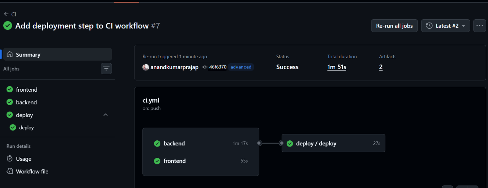

# CI.yml
```yaml
# Goal - I have to Lint, Build, Test the code for Frontend & Backend
# then Push the images to DockerHub 
name: CI

on: 
    push:
        branches: [advanced]

jobs:
    frontend:
        # Github runner
        runs-on: ubuntu-latest
        steps:
            - name: Checkout Code
              uses: actions/checkout@v7

            - name: Setup NodeJs
              uses: actions/setup-node@v6
              with:
                node-version: '20'
                cache: npm
                cache-dependency-path: frontend/package-lock.json
            
            - name: Install npm Packages
              run: npm install
              working-directory: frontend

            - name: Run Linter
              run: npm run lint
              working-directory: frontend

            - name: Run Tests
              run: npm run test 
              working-directory: frontend
            
            - name: Docker Setup [Login]
              uses: docker/login-action@v4
              with:
                username: ${{ vars.DOCKERHUB_USERNAME }}
                password: ${{ secrets.DOCKERHUB_TOKEN }}

            - name: Docker Build and Push
              uses: docker/build-push-action@v7
              with:
                context: ./frontend
                push: true
                tags: ${{ vars.DOCKERHUB_USERNAME }}/devboard-frontend:latest
                
    backend:
        # Github runner
        runs-on: ubuntu-latest
        steps:
            - name: Checkout Code
              uses: actions/checkout@v7

            - name: Setup Go
              uses: actions/setup-go@v6
              with:
                go-version: '1.23'
                go-version-file: 'go.mod'
                cache-dependency-path: go.sum
            
            - name: Run Go Formatter
              run: go fmt
              working-directory: backend

            - name: Run Go Vet
              run: go vet
              working-directory: backend
            
            - name: Run Tests
              run: go test 
              working-directory: backend
            
            - name: Docker Setup [Login]
              uses: docker/login-action@v4
              with:
                username: ${{ vars.DOCKERHUB_USERNAME }}
                password: ${{ secrets.DOCKERHUB_TOKEN }}

            - name: Docker Build and Push
              uses: docker/build-push-action@v7
              with:
                context: ./backend
                push: true
                tags: ${{ vars.DOCKERHUB_USERNAME }}/devboard-backend:latest
    deploy:
        needs: [frontend,backend]
        uses: ./.github/workflows/cd.yml
        secrets: inherit
```

# CD.yml 

```yaml
# Goal: To deploy the built images from CI Steps once the CI Worklow is Succeeded

name: CD

on: 
    workflow_call:

jobs:
    deploy:
        
        runs-on: self-hosted
        steps:
            - name: Code Checkout
              uses: actions/checkout@v7

            - name: Copy Example Env to main env
              run: cp .env.example .env

            - name: Docker Setup [Login]
              uses: docker/login-action@v4
              with:
                username: ${{ vars.DOCKERHUB_USERNAME }}
                password: ${{ secrets.DOCKERHUB_TOKEN }}

            - name: Deploy the containers with Docker Compose
              run: |
                docker compose pull
                docker compose up -d
```




# DevBoard GitHub Actions CI/CD Pipeline

## 1. Overall Goal

The goal is to automatically:

1. Lint the Frontend code
2. Test the Frontend code
3. Check the Backend code
4. Test the Backend code
5. Build the Frontend Docker image
6. Build the Backend Docker image
7. Push both images to Docker Hub
8. Deploy the images using Docker Compose

---

# 2. Complete CI/CD Flow

```text
                         Developer
                             │
                             │ git push
                             ▼
                       advanced branch
                             │
                             ▼
                    ┌─────────────────┐
                    │  GitHub Actions │
                    └────────┬────────┘
                             │
                  ┌──────────┴──────────┐
                  │                     │
                  ▼                     ▼
             FRONTEND                BACKEND
                  │                     │
          Install npm packages     Go setup
                  │                     │
               Lint                go fmt
                  │                     │
               Test                go vet
                  │                     │
          Docker Build             Go Test
                  │                     │
          Docker Push              Docker Build
                  │                     │
                  ▼                     ▼
             Docker Hub             Docker Hub
                  │                     │
                  └──────────┬──────────┘
                             │
                             │ Both CI jobs succeed
                             ▼
                         CD WORKFLOW
                             │
                             ▼
                    Self-hosted Runner
                             │
                             ▼
                      Docker Hub Login
                             │
                             ▼
                       docker compose pull
                             │
                             ▼
                       docker compose up -d
                             │
                             ▼
                         Application
```

---

# 3. CI — Continuous Integration

The CI workflow is responsible for checking the code and creating Docker images.

## CI Pipeline

```text
Git Push
   ↓
Frontend Job ──┐
               ├──→ Docker Hub
Backend Job  ──┘
   ↓
Both successful
   ↓
CD Deployment
```

---

# 4. CI Workflow

```yaml
# ============================================================
# GOAL
# ============================================================
#
# Lint, Build and Test the Frontend and Backend code.
#
# After successful checks:
#
# Frontend Docker Image → Docker Hub
# Backend Docker Image  → Docker Hub
#
# After BOTH jobs succeed:
# CI calls the CD reusable workflow.
#


# ============================================================
# WORKFLOW NAME
# ============================================================

# Name displayed in the GitHub Actions tab.
name: CI


# ============================================================
# WORKFLOW TRIGGER
# ============================================================

# 'on' defines when this workflow should start.
on:

  # Run the workflow whenever code is pushed.
  push:

    # Run only when code is pushed to the 'advanced' branch.
    branches: [advanced]


# ============================================================
# JOBS
# ============================================================

# All CI jobs are defined under 'jobs'.
jobs:


  # ==========================================================
  # FRONTEND JOB
  # ==========================================================

  frontend:

    # Run this job on a GitHub-hosted Ubuntu runner.
    runs-on: ubuntu-latest

    steps:

      # ------------------------------------------------------
      # STEP 1 — CHECKOUT CODE
      # ------------------------------------------------------

      # Download/checkout repository source code
      # into the GitHub Actions runner.
      - name: Checkout Code
        uses: actions/checkout@v7


      # ------------------------------------------------------
      # STEP 2 — SETUP NODE.JS
      # ------------------------------------------------------

      # Install/setup Node.js on the runner.
      - name: Setup NodeJs
        uses: actions/setup-node@v6

        with:

          # Use Node.js version 20.
          node-version: '20'

          # Enable npm dependency caching.
          cache: npm

          # Tell setup-node where the package-lock.json
          # file is located.
          #
          # This is important because the frontend is
          # inside the 'frontend' directory.
          cache-dependency-path: frontend/package-lock.json


      # ------------------------------------------------------
      # STEP 3 — INSTALL FRONTEND DEPENDENCIES
      # ------------------------------------------------------

      # Install packages defined in frontend/package.json.
      #
      # working-directory means:
      #
      # Run this command inside:
      #
      # frontend/
      #
      - name: Install npm Packages
        run: npm install
        working-directory: frontend


      # ------------------------------------------------------
      # STEP 4 — RUN FRONTEND LINTER
      # ------------------------------------------------------

      # Run the lint script defined in frontend/package.json.
      #
      # Example:
      #
      # "scripts": {
      #   "lint": "biome check ."
      # }
      #
      # npm run lint
      # runs that script.
      - name: Run Linter
        run: npm run lint
        working-directory: frontend


      # ------------------------------------------------------
      # STEP 5 — RUN FRONTEND TESTS
      # ------------------------------------------------------

      # Run frontend test cases.
      #
      # Example:
      #
      # npm run test
      #
      - name: Run Tests
        run: npm run test
        working-directory: frontend


      # ------------------------------------------------------
      # STEP 6 — LOGIN TO DOCKER HUB
      # ------------------------------------------------------

      # Login to Docker Hub so that GitHub Actions
      # can push the Docker image.
      - name: Docker Setup [Login]
        uses: docker/login-action@v4

        with:

          # Docker Hub username stored as
          # a GitHub repository variable.
          username: ${{ vars.DOCKERHUB_USERNAME }}

          # Docker Hub access token stored securely
          # as a GitHub repository secret.
          password: ${{ secrets.DOCKERHUB_TOKEN }}


      # ------------------------------------------------------
      # STEP 7 — BUILD AND PUSH FRONTEND IMAGE
      # ------------------------------------------------------

      # Build the frontend Docker image and push it
      # to Docker Hub.
      - name: Docker Build and Push
        uses: docker/build-push-action@v7

        with:

          # Docker build context.
          #
          # Docker will use the frontend directory
          # as the build context.
          context: ./frontend

          # Push image after successful build.
          push: true

          # Docker image name:
          #
          # USERNAME/devboard-frontend:latest
          #
          tags: ${{ vars.DOCKERHUB_USERNAME }}/devboard-frontend:latest


  # ==========================================================
  # BACKEND JOB
  # ==========================================================

  backend:

    # Run Backend job on Ubuntu GitHub runner.
    runs-on: ubuntu-latest

    steps:

      # ------------------------------------------------------
      # STEP 1 — CHECKOUT CODE
      # ------------------------------------------------------

      # Checkout repository code.
      - name: Checkout Code
        uses: actions/checkout@v7


      # ------------------------------------------------------
      # STEP 2 — SETUP GO
      # ------------------------------------------------------

      # Setup Go environment.
      - name: Setup Go
        uses: actions/setup-go@v6

        with:

          # Go version.
          go-version: '1.23'

          # Read the Go version from go.mod.
          #
          # IMPORTANT:
          # If go-version-file is used, the version in
          # go.mod determines the Go version.
          go-version-file: 'go.mod'

          # Dependency cache file.
          cache-dependency-path: go.sum


      # ------------------------------------------------------
      # STEP 3 — FORMAT GO CODE
      # ------------------------------------------------------

      # Run Go formatter.
      #
      # go fmt checks/formats Go source code.
      - name: Run Go Formatter
        run: go fmt
        working-directory: backend


      # ------------------------------------------------------
      # STEP 4 — RUN GO VET
      # ------------------------------------------------------

      # Run Go's static analysis tool.
      #
      # go vet detects suspicious constructs
      # and potential problems in Go code.
      - name: Run Go Vet
        run: go vet
        working-directory: backend


      # ------------------------------------------------------
      # STEP 5 — RUN BACKEND TESTS
      # ------------------------------------------------------

      # Execute Go test cases.
      - name: Run Tests
        run: go test
        working-directory: backend


      # ------------------------------------------------------
      # STEP 6 — LOGIN TO DOCKER HUB
      # ------------------------------------------------------

      # Login to Docker Hub.
      - name: Docker Setup [Login]
        uses: docker/login-action@v4

        with:

          # Docker Hub username.
          username: ${{ vars.DOCKERHUB_USERNAME }}

          # Docker Hub access token.
          password: ${{ secrets.DOCKERHUB_TOKEN }}


      # ------------------------------------------------------
      # STEP 7 — BUILD AND PUSH BACKEND IMAGE
      # ------------------------------------------------------

      # Build backend Docker image and push it to Docker Hub.
      - name: Docker Build and Push
        uses: docker/build-push-action@v7

        with:

          # Backend Docker build context.
          context: ./backend

          # Push image to Docker Hub.
          push: true

          # Backend image name and tag.
          tags: ${{ vars.DOCKERHUB_USERNAME }}/devboard-backend:latest


  # ==========================================================
  # DEPLOY JOB
  # ==========================================================

  deploy:

    # IMPORTANT:
    #
    # CD will run only after BOTH:
    #
    # frontend
    # backend
    #
    # jobs have successfully completed.
    needs: [frontend, backend]


    # This is a reusable workflow call.
    #
    # Instead of putting deployment commands directly
    # inside this CI file, we call cd.yml.
    uses: ./.github/workflows/cd.yml


    # Pass GitHub secrets to the reusable CD workflow.
    secrets: inherit
```

---

# 5. Frontend CI Flow

The Frontend job performs:

```text
Checkout
   ↓
Setup Node.js 20
   ↓
Install npm Packages
   ↓
Run Linter
   ↓
Run Tests
   ↓
Docker Login
   ↓
Docker Build
   ↓
Docker Push
```

If lint fails:

```text
Linter
  ↓
FAIL
  ↓
Job stops
  ↓
Docker Build/Push does NOT run
```

If tests fail:

```text
Tests
  ↓
FAIL
  ↓
Job stops
  ↓
Docker Build/Push does NOT run
```

Therefore, within the frontend job:

```text
Lint → Test → Docker Build → Docker Push
```

---

# 6. Backend CI Flow

The Backend job performs:

```text
Checkout
   ↓
Setup Go
   ↓
go fmt
   ↓
go vet
   ↓
go test
   ↓
Docker Login
   ↓
Docker Build
   ↓
Docker Push
```

If `go vet` fails:

```text
go vet
   ↓
FAIL
   ↓
Job stops
   ↓
Docker Build/Push does NOT run
```

If `go test` fails:

```text
go test
   ↓
FAIL
   ↓
Job stops
   ↓
Docker Build/Push does NOT run
```

---

# 7. Frontend and Backend Run in Parallel

There is no `needs` between:

```yaml
frontend:
```

and:

```yaml
backend:
```

Therefore GitHub Actions can execute them independently.

```text
                    Git Push
                       │
                       ▼
                GitHub Actions
                       │
             ┌─────────┴─────────┐
             │                   │
             ▼                   ▼
         FRONTEND             BACKEND
             │                   │
       Lint → Test          fmt → vet → test
             │                   │
       Docker Build          Docker Build
             │                   │
       Docker Push           Docker Push
             │                   │
             ▼                   ▼
        Docker Hub           Docker Hub
             │                   │
             └─────────┬─────────┘
                       │
                       ▼
                  deploy job
                       │
                       ▼
                      CD
```

This is useful because Frontend and Backend do not need to wait for each other.

---

# 8. Understanding `needs: [frontend, backend]`

The deploy job contains:

```yaml
deploy:
  needs: [frontend, backend]
```

This creates a dependency.

It means:

> Start the CD deployment only when both the Frontend and Backend CI jobs succeed.

### Success

```text
Frontend ── SUCCESS ──┐
                      ├──→ Deploy
Backend  ── SUCCESS ──┘
```

### Frontend failure

```text
Frontend ── FAIL ──┐
                   ├──→ Deploy ❌
Backend  ── SUCCESS┘
```

### Backend failure

```text
Frontend ── SUCCESS ─┐
                     ├──→ Deploy ❌
Backend  ── FAIL ────┘
```

So:

```text
needs: [frontend, backend]
```

is the **CI → CD gate**.

---

# 9. Reusable Workflow

This line:

```yaml
uses: ./.github/workflows/cd.yml
```

means:

> Call another GitHub Actions workflow named `cd.yml`.

The CD workflow is therefore separated from the CI workflow.

Project structure:

```text
.github/
└── workflows/
    ├── ci.yml
    └── cd.yml
```

Conceptually:

```text
ci.yml
   │
   │ needs:
   │ frontend + backend
   ▼
cd.yml
```

---

# 10. Why `workflow_call` Is Used

Inside `cd.yml`:

```yaml
on:
  workflow_call:
```

This means:

> This workflow is designed to be called by another GitHub Actions workflow.

Therefore:

```text
ci.yml
   │
   │ calls
   ▼
cd.yml
```

The `cd.yml` workflow is a **reusable workflow**.

---

# 11. CD — Continuous Deployment

The CD workflow is responsible for deploying the Docker images that CI has already pushed to Docker Hub.

## CD Flow

```text
CI Successful
     │
     ▼
CD Workflow
     │
     ▼
Self-hosted Runner
     │
     ▼
Checkout Code
     │
     ▼
Create .env
     │
     ▼
Docker Hub Login
     │
     ▼
docker compose pull
     │
     ▼
Download Latest Images
     │
     ▼
docker compose up -d
     │
     ▼
Running Containers
```

---

# 12. CD Workflow with Comments

```yaml
# ============================================================
# GOAL
# ============================================================
#
# Deploy the Docker images created and pushed by CI.
#
# CI:
#   Build → Push images to Docker Hub
#
# CD:
#   Pull images → Start containers
#


# ============================================================
# WORKFLOW NAME
# ============================================================

# Name of the CD workflow.
name: CD


# ============================================================
# TRIGGER
# ============================================================

# workflow_call means:
#
# This workflow is NOT intended to be triggered directly
# by a normal git push.
#
# Another workflow can call this workflow.
on:
  workflow_call:


# ============================================================
# JOBS
# ============================================================

jobs:

  # Deployment job.
  deploy:

    # --------------------------------------------------------
    # RUNNER
    # --------------------------------------------------------

    # Use a self-hosted GitHub Actions runner.
    #
    # This runner is your own machine/server.
    #
    # Example:
    #
    # AWS EC2
    #
    # GitHub sends the deployment commands to this machine.
    runs-on: self-hosted


    steps:

      # ------------------------------------------------------
      # STEP 1 — CHECKOUT CODE
      # ------------------------------------------------------

      # Checkout the repository on the deployment server.
      #
      # This gives the runner access to files such as:
      #
      # docker-compose.yml
      # .env.example
      # Docker configuration
      #
      - name: Code Checkout
        uses: actions/checkout@v7


      # ------------------------------------------------------
      # STEP 2 — CREATE .ENV FILE
      # ------------------------------------------------------

      # Copy the example environment file to .env.
      #
      # .env.example
      #      ↓
      #      cp
      #      ↓
      # .env
      #
      - name: Copy Example Env to main env
        run: cp .env.example .env


      # ------------------------------------------------------
      # STEP 3 — LOGIN TO DOCKER HUB
      # ------------------------------------------------------

      # Login to Docker Hub from the deployment server.
      #
      # This allows docker compose pull to access
      # the required Docker images.
      - name: Docker Setup [Login]
        uses: docker/login-action@v4

        with:

          # Docker Hub username.
          username: ${{ vars.DOCKERHUB_USERNAME }}

          # Docker Hub access token.
          password: ${{ secrets.DOCKERHUB_TOKEN }}


      # ------------------------------------------------------
      # STEP 4 — PULL AND START CONTAINERS
      # ------------------------------------------------------

      # Run multiple Docker Compose commands.
      - name: Deploy the containers with Docker Compose
        run: |

          # --------------------------------------------------
          # Pull latest images from Docker Hub.
          # --------------------------------------------------
          #
          # Example:
          #
          # Docker Hub
          #     ↓
          # devboard-frontend:latest
          #     ↓
          # EC2/server
          #
          docker compose pull


          # --------------------------------------------------
          # Start/recreate containers in detached mode.
          # --------------------------------------------------
          #
          # -d = detached mode
          #
          # Containers run in the background.
          docker compose up -d
```

---

# 13. Understanding `runs-on: self-hosted`

CI uses:

```yaml
runs-on: ubuntu-latest
```

CD uses:

```yaml
runs-on: self-hosted
```

### GitHub-hosted runner

```text
GitHub
  │
  ▼
Temporary Ubuntu Runner
  │
  ▼
Lint / Test / Build
```

The runner is managed by GitHub.

### Self-hosted runner

```text
GitHub
  │
  ▼
Your Server / EC2
  │
  ▼
Self-hosted Runner
  │
  ▼
Docker Compose
  │
  ▼
Application Containers
```

This is useful for deployment because Docker Compose can run directly on your server.

---

# 14. Understanding `.env`

You have:

```bash
cp .env.example .env
```

This means:

```text
.env.example
      │
      │ copy
      ▼
     .env
```

For example:

```text
.env.example
----------------
POSTGRES_USER=example
POSTGRES_PASSWORD=example
POSTGRES_DB=devboard
```

becomes:

```text
.env
----------------
POSTGRES_USER=...
POSTGRES_PASSWORD=...
POSTGRES_DB=...
```

Your `docker-compose.yml` can then read these environment variables.

---

# 15. Docker Hub Login in CD

CD also performs:

```yaml
- name: Docker Setup [Login]
  uses: docker/login-action@v4
```

Why?

Because the deployment server needs to pull private Docker images if the repositories are private.

```text
EC2
 │
 │ Docker Login
 ▼
Docker Hub
 │
 │ Pull image
 ▼
EC2
```

---

# 16. `docker compose pull`

Command:

```bash
docker compose pull
```

means:

> Pull the images specified by `docker-compose.yml` from the container registry.

Example:

```yaml
services:

  frontend:
    image: USERNAME/devboard-frontend:latest

  backend:
    image: USERNAME/devboard-backend:latest
```

Then:

```bash
docker compose pull
```

does approximately:

```text
Docker Hub
   │
   ├── devboard-frontend:latest
   │
   └── devboard-backend:latest
          │
          ▼
       Server
```

---

# 17. `docker compose up -d`

Command:

```bash
docker compose up -d
```

means:

> Create/start the services defined in `docker-compose.yml` and run them in the background.

`-d` means:

```text
detached mode
```

Without `-d`:

```bash
docker compose up
```

the logs remain attached to the terminal.

With `-d`:

```bash
docker compose up -d
```

containers continue running in the background.

---

# 18. Complete CI + CD Architecture

```text
                         Developer
                             │
                             │ git push
                             ▼
                    advanced branch
                             │
                             ▼
                    ┌────────────────┐
                    │ GitHub Actions │
                    └───────┬────────┘
                            │
              ┌─────────────┴─────────────┐
              │                           │
              ▼                           ▼
        FRONTEND JOB                 BACKEND JOB
              │                           │
        Setup Node.js                 Setup Go
              │                           │
        npm install                    go fmt
              │                           │
        npm run lint                   go vet
              │                           │
        npm run test                   go test
              │                           │
        Docker Build                  Docker Build
              │                           │
        Docker Push                   Docker Push
              │                           │
              ▼                           ▼
        Docker Hub                    Docker Hub
              │                           │
              └─────────────┬─────────────┘
                            │
                  needs: frontend, backend
                            │
                            ▼
                         CD.yml
                            │
                            ▼
                    Self-hosted Runner
                       / AWS EC2
                            │
                            ▼
                     Docker Hub Login
                            │
                            ▼
                   docker compose pull
                            │
                            ▼
                 Latest Docker Images
                            │
                            ▼
                  docker compose up -d
                            │
                            ▼
                    Running Application
```

---

# 19. CI vs CD

| CI                     | CD                    |
| ---------------------- | --------------------- |
| Continuous Integration | Continuous Deployment |
| Check code             | Deploy application    |
| Lint                   | Pull Docker images    |
| Test                   | Start containers      |
| Build Docker image     | Docker Compose        |
| Push Docker image      | Server/EC2            |
| GitHub-hosted runner   | Self-hosted runner    |

---

# 20. CI Responsibilities

```text
CI
│
├── Frontend
│   ├── Checkout
│   ├── Node.js
│   ├── npm install
│   ├── Lint
│   ├── Test
│   ├── Docker Build
│   └── Docker Push
│
└── Backend
    ├── Checkout
    ├── Go setup
    ├── go fmt
    ├── go vet
    ├── go test
    ├── Docker Build
    └── Docker Push
```

---

# 21. CD Responsibilities

```text
CD
│
├── Checkout repository
│
├── Create .env
│
├── Login to Docker Hub
│
├── docker compose pull
│
└── docker compose up -d
```

---

# 22. Important `needs` Concept

There are two different levels of dependency in your pipeline.

### Frontend/Backend

They have no dependency on each other:

```text
Frontend ──────────┐
                   │
                   ▼
                 Deploy
                   ▲
                   │
Backend ───────────┘
```

### Deploy

Deploy depends on both:

```yaml
needs: [frontend, backend]
```

Therefore:

```text
Frontend SUCCESS
       +
Backend SUCCESS
       ↓
     Deploy
```

---

# 23. Important Failure Behavior

### Frontend lint fails

```text
Frontend
   ↓
Lint
   ↓
FAIL
   ↓
Frontend job stops
   ↓
Frontend image is NOT pushed
   ↓
Deploy does NOT run
```

### Backend test fails

```text
Backend
   ↓
go test
   ↓
FAIL
   ↓
Backend job stops
   ↓
Backend image is NOT pushed
   ↓
Deploy does NOT run
```

### Both succeed

```text
Frontend SUCCESS
       │
       ├── Docker image → Docker Hub
       │
Backend SUCCESS
       │
       ├── Docker image → Docker Hub
       │
       └──────────┬──────────┘
                  ▼
                CD
                  │
                  ▼
          docker compose pull
                  │
                  ▼
          docker compose up -d
```

---

# 24. CI/CD in One Line

### CI

```text
Code → Lint → Test → Docker Build → Docker Push
```

### CD

```text
Docker Hub → Pull Image → Docker Compose → Running Containers
```

### Complete DevBoard Pipeline

```text
Developer
    ↓
git push
    ↓
GitHub Actions
    ↓
┌──────────────────────────────┐
│            CI                │
│                              │
│ Frontend: Lint → Test        │
│ Backend:  fmt → vet → Test   │
│                              │
│       ↓              ↓       │
│    Docker          Docker    │
│     Build           Build    │
│       ↓              ↓       │
│    Push            Push      │
└───────┬──────────────┬───────┘
        │              │
        └──────┬───────┘
               ▼
          Docker Hub
               │
               ▼
             CD
               │
               ▼
        Self-hosted EC2
               │
               ▼
     docker compose pull
               │
               ▼
     docker compose up -d
               │
               ▼
        DevBoard Running
```

---

# 25. Quick Revision Notes

```text
CI
 ↓
Continuous Integration

CD
 ↓
Continuous Deployment

on:
 ↓
Workflow trigger

push:
 ↓
Run workflow after git push

branches:
 ↓
Restrict workflow to specific branch

jobs:
 ↓
Define jobs

runs-on:
 ↓
Select runner

ubuntu-latest:
 ↓
GitHub-hosted Ubuntu runner

self-hosted:
 ↓
Your own registered runner/server

uses:
 ↓
Use an existing GitHub Action

run:
 ↓
Execute shell command

working-directory:
 ↓
Run command inside a specific directory

needs:
 ↓
Create job dependency

workflow_call:
 ↓
Allow another workflow to call this workflow

vars:
 ↓
GitHub repository variables

secrets:
 ↓
Secure sensitive values

push: true
 ↓
Push Docker image

context:
 ↓
Directory sent to Docker build

docker compose pull
 ↓
Pull images from registry

docker compose up -d
 ↓
Start containers in background
```

# 26. Final Architecture

```text
                         DEVBOARD CI/CD
                              │
                 ┌────────────┴────────────┐
                 │                         │
                 ▼                         ▼
             FRONTEND                   BACKEND
                 │                         │
          Lint + Test                fmt + vet + test
                 │                         │
                 ▼                         ▼
           Docker Build              Docker Build
                 │                         │
                 ▼                         ▼
           Docker Push               Docker Push
                 │                         │
                 └────────────┬────────────┘
                              ▼
                         Docker Hub
                              │
                     CI SUCCESS GATE
                              │
                              ▼
                         CD Workflow
                              │
                              ▼
                     Self-hosted EC2
                              │
                              ▼
                  docker compose pull
                              │
                              ▼
                  docker compose up -d
                              │
                              ▼
                     🚀 DevBoard App
```

> **Simple rule to remember:**
>
> **CI checks and packages the application.**
>
> **CD takes the packaged Docker images and deploys them to the server.**

